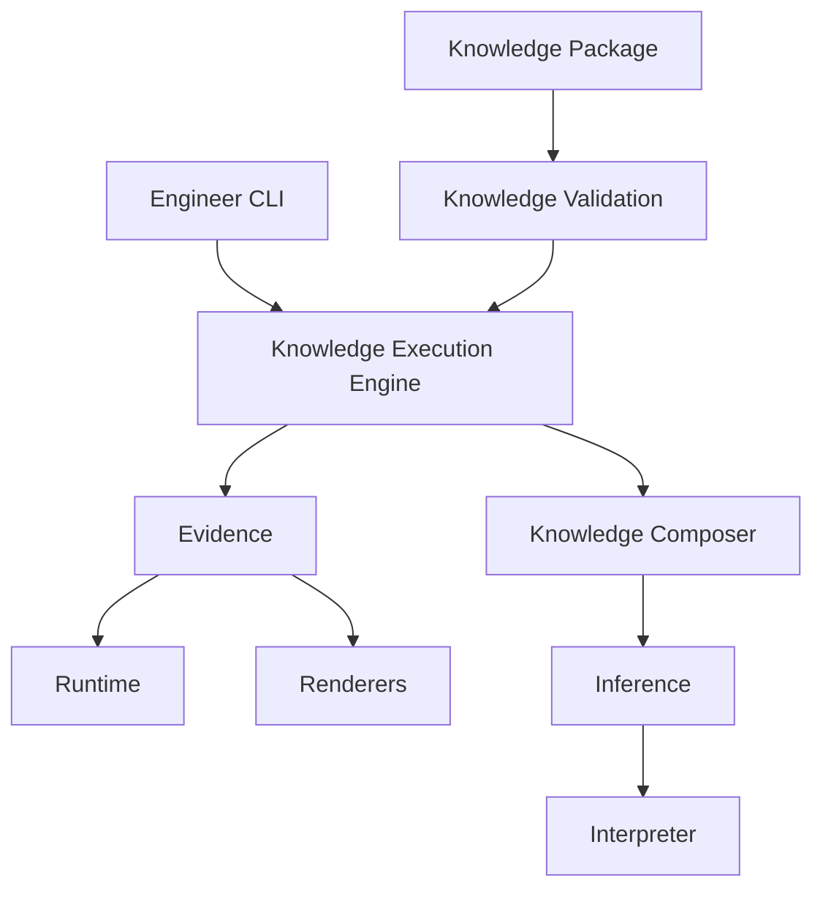

# Knowledge Execution Architecture

## Vision

Engineering Lab is a Knowledge-Driven Engineering Platform.

The platform separates engineering expertise from executable software by representing engineering knowledge as version-controlled artifacts executed through a deterministic execution engine.

The long-term objective is to improve engineering capability by evolving knowledge rather than increasing software complexity.

Knowledge should outlive implementation.

---

# Architectural Principles

The platform is organized into independent subsystems.

Each subsystem owns exactly one responsibility.

Subsystems communicate through explicit contracts rather than implementation details.

Knowledge evolves.

Execution remains stable.

---

# Target Architecture



---

# Subsystems

## Engineer CLI

The public interface to Engineering Lab.

Responsibilities:

- User interaction
- Command dispatch
- Capability discovery

The CLI should never contain engineering reasoning.

---

## Knowledge Packages

Knowledge Packages define how engineering tasks are performed.

Responsibilities:

- engineering methodology
- engineering philosophy
- assumptions
- calibration
- expectations

Knowledge Packages contain no executable logic.

---

## Knowledge Validation

Validates Knowledge Packages before execution.

Responsibilities:

- package completeness
- schema validation
- dependency validation
- knowledge quality
- behavioral validation (future)

Knowledge Validation protects the quality of engineering expertise.

---

## Knowledge Execution Engine

Coordinates engineering task execution.

Responsibilities:

- task orchestration
- dependency resolution
- execution pipeline

The execution engine should remain unaware of task-specific engineering behavior.

---

## Evidence

Provides the information required for engineering reasoning.

Responsibilities:

- collect engineering evidence
- normalize evidence contracts
- expose reusable reasoning material

Evidence should describe information.

Evidence should never describe reasoning.

---

## Runtime

Discovers engineering facts.

Responsibilities:

- project discovery
- git discovery
- platform discovery
- environment discovery

Runtime owns engineering facts.

---

## Renderers

Transform engineering information into representations.

Responsibilities:

- JSON → Markdown
- JSON → HTML
- JSON → Future representations

Renderers never discover information.

---

## Knowledge Composer

Assembles engineering knowledge with engineering evidence.

Responsibilities:

- compose Knowledge Packages
- combine Evidence
- prepare inference input

Composers do not perform reasoning.

---

## Inference

Executes engineering reasoning.

Responsibilities:

- local inference
- provider abstraction
- model abstraction

Inference reasons.

Nothing else.

---

## Interpreter

Normalizes inference output.

Responsibilities:

- response normalization
- structured output
- future execution artifacts

Interpreters prepare reasoning for downstream consumers.

---

# Knowledge Package Architecture

Every engineering task is represented by a Knowledge Package.

Example:

```text
knowledge/

    repository/

        review/

            definition.json

            README.md

            instructions.md

            background.md

            assumptions.md

            principles.md

            calibration.md

            expectations.md
```

Each artifact owns a single responsibility.

Knowledge should never be duplicated across artifacts.

---

# Execution Pipeline

Engineering Lab executes engineering work through a deterministic pipeline.

```text
Knowledge Package
        ↓
Knowledge Validation
        ↓
Knowledge Execution Engine
        ↓
Evidence
        ↓
Knowledge Composer
        ↓
Inference
        ↓
Interpreter
```

Each stage performs exactly one responsibility.

---

# Platform Philosophy

Engineering Lab favors:

- explicit responsibilities
- composable architecture
- deterministic execution
- reusable knowledge
- evolutionary design
- engineering mentorship
- evidence-based reasoning
- long-term maintainability

---

# Evolution Strategy

Engineering Lab evolves by teaching rather than rewriting.

Future engineering capabilities should primarily require:

- new Knowledge Packages
- improved engineering principles
- richer calibration
- additional evidence providers

The execution engine should rarely require modification.

---

# Long-Term Vision

Engineering Lab is not intended to become another AI assistant.

Engineering Lab is intended to become an Engineering Operating System.

Its purpose is to capture, validate, execute, and continuously improve engineering expertise.

Software executes.

Knowledge teaches.

Engineers improve.

The platform should become smarter by improving engineering knowledge—not by increasing software complexity.